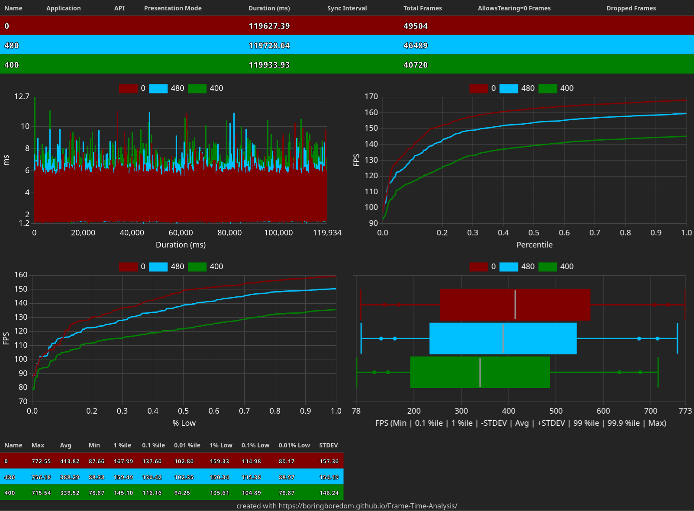

# CS2 Frametime Analysis (Linux vs Windows)

## Hypothesis / Research Question
When utilizing a modern mid-range AMD hardware configuration (Ryzen 7 5700X / RX 7600), which operating system and frame cap configuration yields the optimal balance of high average frame rates and minimal micro-stutters?

---

## Methodology & Settings

### Benchmark Scenario
* **Map:** Dust2 with bots in infinite warm-up.
* **Duration:** 120-second frametime log.
* **Frame Caps Tested (`fps_max`):** 0 (Uncapped), 480, 400.

### Advanced Video Settings
* **Resolution:** 1280x960 Stretched Fullscreen (Exclusive on Windows and Windowed on Linux)

| CS2 In-Game Setting Option | Value |
| :--- | :--- |
| **Boost Player Contrast** | Enabled |
| **Anti-Aliasing Mode** | CMAA2 |
| **Global Shadow Quality** | Low |
| **Model / Texture Detail** | Medium |
| **Texture Filtering Mode** | Anisotropic 4x |
| **Shader Detail** | Low |
| **Particle Detail** | Low |
| **Ambient Occlusion** | Disabled |
| **High Dynamic Range (HDR)** | Quality |
| **FidelityFX Super Resolution (FSR)** | Disabled |

---

## Test Environments

### Hardware Specifications
* **CPU:** AMD Ryzen 7 5700X (3.4GHz / 4.6GHz Turbo, 8C/16T, AM4)
* **GPU:** ASUS Dual Radeon RX 7600 V2 8GB GDDR6
* **RAM:** XPG Gammix D10 16GB (2x8GB) DDR4 3200MHz CL16 (XMP Enabled)
* **Storage:** Kingston KC3000 512GB NVMe PCIe 4.0 M.2 SSD
* **Motherboard:** ASUS TUF Gaming B550M-Plus (AMD B550)
* **Cooler:** DeepCool AK400 Air Cooler
* **PSU:** Cooler Master MWE Gold 650W V3 (80 Plus Gold)
* **Case:** Corsair 480T Airflow Mid-Tower ATX

### Linux Environment
* **OS:** Arch Linux
* **Kernel:** 7.0.12-arch1-1 (64-bit) and 7.0.12-zen1-1-zen (64-bit)
* **Desktop Environment:** KDE Plasma 6.6.5 (Frameworks 6.26.0 / Qt 6.11.1)
* **Display Server:** Wayland (KDE Native Stretched, No Gamescope)
* **Graphics Driver:** Mesa 26.1.2-arch1.1 (RADV)
* **API / Optimization:** Vulkan | Smart Access Memory (SAM) Enabled
* **Capture Tool:** MangoHud
* **Launch Option:** MANGOHUD_CONFIG="output_folder=~/Documents,output_file=cs2,log_duration=120" gamemoderun mangohud %command%

### Windows Environment
* **OS:** Windows 11 Home 25H2 (Build 26200.8655)
* **Graphics Driver:** AMD Adrenalin 26.6.1
* **API / Optimization:** DX11 | HAGS Enabled | Performance Power Plan | SAM Enabled | Game Mode Enabled
* **Capture Tool:** OCAT
* **Launch Option:** -allow_third_party_software

---

## Benchmarking Results

### Linux Performance Data

### Linux-zen Performance Data

### Windows Performance Data

---

## Performance Ranking & Synthesis

The 9 tested configurations are ranked below based on a balanced evaluation of maximizing average frame rates and elevating the lowest frame drops (1% and 0.1% Lows) to eliminate micro-stutters:

1. **Linux-Zen — Uncapped (`fps_max 0`)** (Best overall frametime floors and peak FPS)
2. **Linux Stock — Uncapped (`fps_max 0`)**
3. **Windows 11 — Uncapped (`fps_max 0`)** (Best absolute frame-to-frame consistency/STDEV)
4. **Linux-Zen — Capped 480 FPS**
5. **Windows 11 — Capped 480 FPS**
6. **Linux Stock — Capped 480 FPS**
7. **Linux-Zen — Capped 400 FPS**
8. **Windows 11 — Capped 400 FPS**
9. **Linux Stock — Capped 400 FPS**

---

## Final Conclusions

* **The Linux-Zen Edge:** Running Arch Linux with the optimized Linux-Zen kernel completely uncapped yields the best results. It delivers the highest 0.1% low (137.66 FPS), outperforming Windows 11 by ~11 FPS and stock Linux by ~14 FPS. The Zen kernel's CPU scheduling significantly mitigates heavy micro-stutters.
* **Capping Hurts Performance:** Artificially limiting the frame rate via `fps_max` (480 or 400) degrades performance across all systems. Instead of smoothing frame pacing, engine limits systematically lower both the average FPS and the 1%/0.1% percentile baselines. CS2 runs optimal when entirely uncapped.
* **Windows Consistency vs. Linux Ceiling:** Windows 11 under DX11 registers the tightest mathematical consistency with the lowest Standard Deviation (151.10). However, it sacrifices raw throughput and dips lower during worst-case stutter scenarios compared to Linux-Zen.
* **Statistical Relevance:** The differences between OS/Kernel layers and Uncapped vs. Capped states are statistically significant with clear shifts in data distribution. Conversely, the internal performance variance between capping at 480 FPS versus 400 FPS is mostly statistical noise and virtually indistinguishable during gameplay.
